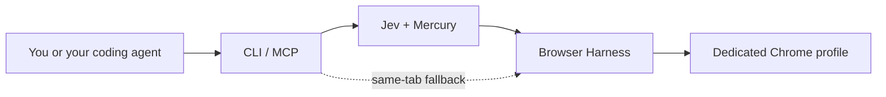

# fastest-e2e

Use a logged-in browser or test a deployed feature from your coding agent or terminal. Application setup and cleanup use the UI. No application API or database access is required.



The CLI and MCP share an Effect v4 runtime. The Python worker reuses upstream Jev Ultrafast and Browser Harness. The profile contains only the accounts you sign into there, not your personal Chrome sessions.

## First run

Requires Node 24.18 or newer, uv, and Google Chrome or Chromium. There is no published npm package yet.

```sh
git clone https://github.com/BleedingDev/fastest-e2e.git
cd fastest-e2e
npm ci
npm run build
npm link
fastest-e2e init
fastest-e2e install
fastest-e2e start --headed
```

Sign into only the intended accounts in the new Chrome window. Keep Chrome sync off. `init` uses `~/.fastest-e2e`; [setup](docs/setup.md) covers custom profiles and installation troubleshooting.

Make `TYPESAFE_API_KEY` and `TEXT_MODEL_API_KEY` available in the invoking shell or secret manager. The default text provider is OpenRouter. See [.env.example](.env.example) and [environment setup](docs/setup.md) for file-based loading. Keep keys out of chat and git. Page and field context goes to the configured model providers.

Then switch the same profile to headless:

```sh
fastest-e2e stop
fastest-e2e start
fastest-e2e doctor
```

In the JSON, `configured`, `workerInstalled`, `connected`, `jevKeyPresent`, and `textKeyPresent` should all be `true`. `doctor` does not validate keys with providers, and its exit code alone does not check key presence. Headed and headless browsers cannot use the directory simultaneously. Logins may expire.

## Use the browser

Replace the URL with your application:

```sh
fastest-e2e run --url https://your-app.example/settings \
  "Read the current display name. Leave all settings unchanged."
```

The command returns a status and `targetId`, not the extracted answer. `done` means Jev stopped, not that the requested outcome was independently verified. Read the page and check the result:

```sh
fastest-e2e inspect --target TARGET_ID
fastest-e2e close --target TARGET_ID
```

Replace `TARGET_ID` with the returned identifier. `inspect` returns the URL, title, and page text. For a control value, a screenshot, or an unsupported interaction, use the [same-tab fallback](docs/fallback.md).

## Test a PR or feature

After [registering the skills](docs/setup.md#skills), give your coding agent a concrete request:

> Use browser-test to test PR #123 at https://preview.example/settings with the account already logged in. Confirm the deployment contains this PR. Keep this run read-only and report checks that need permission to change data.

The agent reads the change, chooses checks, runs them, and reports evidence. The CLI itself does not fetch PRs or deploy code. A production URL that lacks the PR cannot validate it.

To run a test yourself, copy [account.test.json](examples/account.test.json) and replace its URL and expected heading:

```json
{
  "name": "Account settings are available",
  "url": "https://your-app.example/settings",
  "goal": "Open account settings and read the heading. Leave all settings unchanged.",
  "checks": [
    { "kind": "text", "selector": "h1", "value": "Account settings" }
  ]
}
```

```sh
fastest-e2e test --file account.test.json
```

This is a read-only goal, not an enforced read-only browser mode. For authorized write tests, adapt [settings.test.json](examples/settings.test.json) and agree on cleanup. [Testing reference](docs/testing.md) explains assertion types and persistence checks.

| Result | Meaning | Exit code |
| --- | --- | --- |
| `done` | Browser task ended without independent assertions. | 0 |
| `passed` | Jev finished and every explicit check passed. | 0 |
| `failed` | An explicit check did not match. | 1 |
| `blocked` | Execution or verification could not finish. | 2 |

Results include `checks` with expected and actual values. Failed and blocked tests retain their tab. Inspect it before retrying a mutation. A successful test closes its tab unless `keepTab` is `true`.

## Use your coding agent

| Skill | Ask it to do |
| --- | --- |
| [setup-fastest-e2e](skills/setup-fastest-e2e/SKILL.md) | Install or repair the runtime and register the skills. |
| [browser-use](skills/browser-use/SKILL.md) | Complete a browser task and verify what happened. |
| [browser-test](skills/browser-test/SKILL.md) | Test a PR, feature, fix, or regression against a specific deployment. |

Start with the setup skill. [Registration and MCP configuration](docs/setup.md#skills) cover using the same installation from different agents. `fastest-e2e mcp` exposes high-level tools over stdio. Trusted Python fallback is CLI-accessible; MCP exposes it only with `mcp --allow-scripts`.

## Sessions and limits

Chrome and Browser Harness stay warm between tasks. Each `run` or `test` opens a new owned tab with the profile's stored authentication; it does not resume an existing tab. Use the returned target for inspection or fallback. Concurrent operations on one configured home are rejected rather than queued. Separate homes **and** profiles are required for independent sessions.

The runtime checks browser identity and does not discover personal Chrome. This is browser-session separation, not an operating-system sandbox. Keep CDP on loopback. Trusted fallback scripts run with your local permissions.

Jev's MVP lacks support for some frames, shadow roots, canvas, uploads, popup tabs, nested scrolling, and custom keyboard controls. Use [fallback](docs/fallback.md), not a silent pass. Timeouts cannot undo production actions. Cancellation during browser initialization may leave an unregistered tab. `maxSteps` cannot raise upstream limits.

The name is not a benchmark claim. CI exercises real Chrome with scripted model decisions. Live-model reliability, production authentication, and performance on your applications remain to be measured. Patchright and visual-agent frameworks are not included.

## Design and next release

The proposed design centers work on a resumable run with checkpoints, evidence, and explicit uncertainty. It adds scoped verification, requested data extraction, native image delivery, bounded Midscene fallback, and reviewed recipe reuse. These capabilities are not implemented yet.

Start with [VISION.md](VISION.md), then follow the task-specific design links there. The [implementation plan](docs/implementation-plan.md) lists delivery gates and evaluations. Current instructions and examples above remain the source of truth for using this release.

## Develop

```sh
npm ci
npm run check
uv sync --project worker --locked --python 3.12
uv run --project worker --no-sync python worker/tests/browser_smoke.py
node test/lifecycle.smoke.mjs
```

GitHub Actions use full commit SHAs with version comments. A test catches mutable `uses:` references; Dependabot proposes reviewed Action updates without enabling auto-merge. SHA pinning prevents tag replacement from silently changing the selected action, not every supply-chain risk. See [GitHub's security guidance](https://docs.github.com/en/actions/reference/security/secure-use).

## References

[rat-stack](https://github.com/joelhooks/rat-stack) inspired shared Effect handlers, exact pins, and typed failures. [Jev Ultrafast](https://github.com/browser-use/jev-ultrafast) supplies the policy and action loop; [Browser Harness](https://github.com/browser-use/browser-harness) supplies CDP and fallback helpers. The human guide follows [show-me](https://github.com/humanlayer/skills/blob/main/plugins/show-me/skills/show-me/SKILL.md). Skill writing follows [unslop](https://github.com/cursor/plugins/blob/main/pstack/skills/unslop/SKILL.md), [writing-for-agents](https://github.com/mattpocock/skills/blob/main/skills/productivity/writing-for-agents/SKILL.md), and Matt Pocock's [setup pattern](https://github.com/mattpocock/skills/blob/main/skills/engineering/setup-matt-pocock-skills/SKILL.md).

MIT. See [LICENSE](LICENSE).
