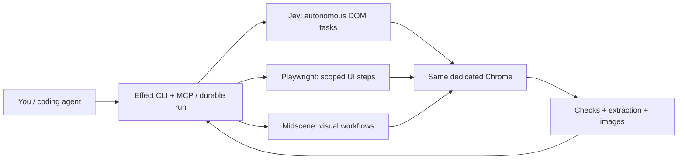

# fastest-e2e

Browser use and evidence-based E2E tests from a coding agent, CLI, or MCP. Use a dedicated, logged-in Chrome profile, normally headless. Application setup and cleanup stay in the UI.



## First run

Requires Node 24.18+, uv, and installed Chrome or Chromium. No npm package is published yet.

```sh
git clone https://github.com/BleedingDev/fastest-e2e.git
cd fastest-e2e
npm ci
npm run build
npm link
fastest-e2e init
fastest-e2e install
fastest-e2e start --headed
```

Sign into only the intended accounts; keep Chrome sync off. Supply `TYPESAFE_API_KEY` and `TEXT_MODEL_API_KEY` through your invoking environment. Then:

```sh
fastest-e2e stop
fastest-e2e start
fastest-e2e doctor
```

Inspect the readiness fields, not just the exit code. Key presence does not prove validity. [Setup](docs/setup.md) covers custom profiles, provider configuration, and registering the three skills.

## Use the browser

```sh
fastest-e2e run --url https://your-app.example/settings \
  "Open account settings. Leave values unchanged."
fastest-e2e inspect --run RUN_ID --view page
fastest-e2e screenshot --run RUN_ID
fastest-e2e close --run RUN_ID
```

Replace `RUN_ID` with the returned `runId`. Summaries include progress, attempt history, evidence references, and budgets. Page inspection returns focused controls/text; screenshots return a local image path. MCP `browser_screenshot` returns the image itself, not a path-only response.

For one-call structured reading, edit [read.task.json](examples/read.task.json), then run `fastest-e2e run --file read.task.json`. The result's `extraction` contains values and evidence, or explicit field errors. No model call is needed for its deterministic checkpoint and DOM extraction.

## Test a PR or feature

Ask an agent with the skills installed:

> Use browser-test to test PR #123 at the deployed preview URL with the logged-in test account. Establish which build is deployed, define checks before acting, and report evidence and untested behavior.

The coding agent reads the PR; the browser runtime does not fetch or deploy it. To run a test yourself, adapt [account.test.json](examples/account.test.json):

```json
{
  "name": "Account settings are available",
  "url": "https://your-app.example/settings",
  "goal": "Open account settings and read the heading. Leave all settings unchanged.",
  "checks": [
    { "kind": "text", "selector": "h1", "value": "Account settings" }
  ]
}
```

```sh
fastest-e2e test --file account.test.json
```

A read-only goal is guidance, not an enforced read-only browser. Authorize production changes before running them. [Testing](docs/testing.md) covers explicit UI steps, frame/shadow scopes, checkpoints, extraction, and cleanup.

| Result | Meaning | Exit |
| --- | --- | --- |
| `done` | Execution completed without a test verdict. | 0 |
| `passed` | Every declared test check passed. | 0 |
| `failed` | A declared check did not match. | 1 |
| `blocked` | Execution, extraction, or verification could not finish. | 2 |

Failed attempts are retained. `verify --run RUN_ID` rechecks saved assertions without replaying actions or replacing the original verdict. Successful tests close their task tab unless `keepTab: true`.

## Choose execution, not a different browser

Jev remains the default. Explicit `steps` use Playwright without model calls; a `goal` step delegates only that subtask. `frames` and `shadow: "open"` support scoped controls and checks. Closed-root DOM access returns unsupported rather than an accidental absence/pass.

For image/canvas workflows, configure vision once, then use `--engine vision`. `--engine auto` permits same-tab Jev-to-Midscene handoff only when the current autonomous segment stopped before dispatching any action. After partial autonomous work, inspect and explicitly resume with the remaining goal. Failed assertions, uncertain submissions, and cancellation never trigger automatic replay. [Fallback](docs/fallback.md) gives the commands.

## Recover work, not imaginary browser state

```sh
fastest-e2e inspect --run RUN_ID
fastest-e2e inspect --run RUN_ID --view page
fastest-e2e resume --run RUN_ID --revision REVISION
```

Use the latest returned revision. Resume verifies the live document and state. A reload or crash may make continuation impossible. An explicitly declared reconstruction plan can rebuild allowed fields through the UI; restart requires a declared repeat-safe workflow. See [recover-form.test.json](examples/recover-form.test.json) and [recovery rules](docs/design.md#recovery).

Uncertain Save/autosave effects block replay until predeclared UI evidence reconciles them. Missing inputs remain missing. Recovery cannot hide a failed persistence test. Action, model-call, and active-time budgets span all attempts; unknown model spend is reported as unknown.

## Agent setup and stored data

Keep the three skills: [browser-use](skills/browser-use/SKILL.md), [browser-test](skills/browser-test/SKILL.md), and [setup-fastest-e2e](skills/setup-fastest-e2e/SKILL.md). `fastest-e2e mcp` exposes the same runtime. Arbitrary Python fallback is separately gated by `mcp --allow-scripts`.

Runs, literal goals/inputs, and evidence are local under the configured home. **Do not put secrets in goals or literal input fields.** Use `valueFromEnv` for sensitive input; never allowlist it for recovery. Records expire after 24 hours by default; `fastest-e2e prune` deletes expired data. Screenshots and model context may contain account data. This is not an OS sandbox or complete redaction system.

Reviewed recipe reuse is explicit: `recipe propose`, `recipe approve` with a distinct verified trial, then a task naming that recipe. It reuses UI procedures, not answers or permissions. [Design](docs/design.md) documents limits and quarantine behavior.

## Develop and verify

```sh
npm ci
uv sync --project worker --locked
npm run check
uv run --project worker --no-sync python worker/tests/browser_smoke.py
uv run --project worker --no-sync python worker/tests/managed_smoke.py
node test/lifecycle.smoke.mjs
npm run test:browser
```

CI uses real Chrome, scripted Jev decisions, and a controlled HTTP model provider with the real Midscene SDK. This proves adapter mechanics, not paid-model quality or compatibility with every production site/client. No performance ranking is claimed. Automatic popup following, arbitrary autonomous file selection, desktop control, and lossless page restoration are not supported.

Dependencies are locked; Actions use full commit SHAs and read-only normal CI permissions. Pinning prevents tag substitution, not every supply-chain risk. [rat-stack](https://github.com/joelhooks/rat-stack) inspired the shared Effect runtime. [show-me](https://github.com/humanlayer/skills/blob/main/plugins/show-me/skills/show-me/SKILL.md), [unslop](https://github.com/cursor/plugins/blob/main/pstack/skills/unslop/SKILL.md), and [writing-for-agents](https://github.com/mattpocock/skills/blob/main/skills/productivity/writing-for-agents/SKILL.md) inform the guides.

MIT. See [LICENSE](LICENSE).
