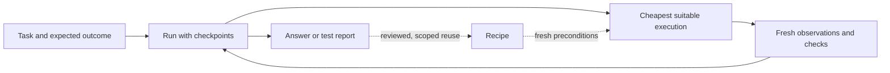

# An agent should inherit the work, not reconstruct it

Status: proposed direction. The [README](README.md) documents the shipped CLI. The [implementation plan](docs/implementation-plan.md) separates that baseline from the work below.

fastest-e2e should let an agent answer four questions after any interruption: What was requested? What actually happened? What remains uncertain? What can I safely do next?

The unit of work is a run, not an engine call or a browser tab. A run keeps the task, browser identity, checkpoints, evidence, remaining budget, and authorized scope together. Changing engines or coding agents should not require reconstructing them from a conversation.

## What the agent should experience

A read request returns the requested value with its source, not just a tab ID. A test request returns evidence against the chosen requirements, not a model's completion claim. An unsupported widget offers a continuation on the same run. An uncertain submission offers inspection, not another submission.

Routine steps stay inside the executor. The coding agent spends its reasoning on interpreting requirements, selecting useful checks, and diagnosing exceptions. It receives enough context to make those decisions and fetches more only when needed.

A second attempt should cost less because it can reuse validated navigation and targeting knowledge. It must still observe current state and verify the requested result. Learned knowledge never grants permission, supplies today's answer from yesterday's page, or relaxes a test expectation.

## Optimize for verified work

First preserve the intended account, authorized changes, and test meaning. Then maximize correctly completed tasks and correctly identified defects. Reduce total time, model calls, output tokens, and repeated exploration within those constraints.

A fast false pass is a failure. A cheap blocked result is also a failure when a supported, authorized continuation was available. Evaluate both.

## Keep the system small

Reuse Jev's policy, Browser Harness's connection, Playwright's targeting, and Midscene's visual loop. The repository owns their shared run contract and evidence. Do not build another browser driver, general workflow language, vector database, or agent framework.

Keep two operational skills and one setup skill. Skills explain when to act and when to inspect evidence. The executable describes installed capabilities. The run carries task-specific state. Reviewed recipes carry reusable site knowledge. None of these should become a growing global prompt.

## Read by task

| Task | Source of truth |
| --- | --- |
| Use the current release | [README](README.md) and command help |
| Change run ownership, execution, or verdicts | [System design](docs/design.md) |
| Change what agents send or receive | [Agent contract](docs/agent-contract.md) |
| Add reusable knowledge or execution recipes | [Learning and reuse](docs/learning.md) |
| Implement or evaluate the next release | [Implementation plan](docs/implementation-plan.md) |

The design documents describe a target, not additional working commands. Update the operational guides and skills only when the matching behavior has passed its acceptance checks.
