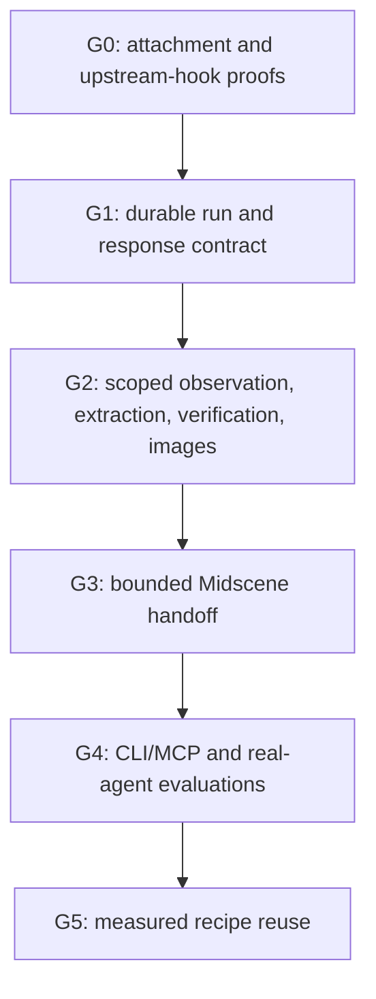

# Implementation plan

Status: proposed. No stages below are implemented by this documentation change. Baseline is `b3b1500`. This plan supersedes the earlier chat-only fallback sequence while retaining Jev, same-profile CDP, Playwright, and Midscene as the intended integrations.

[System design](design.md) owns behavior. [Agent contract](agent-contract.md) owns requests and responses. [Learning and reuse](learning.md) owns recipe policy. This file owns sequencing, acceptance gates, and evaluation. Keep installed skills and examples on the current CLI until their matching gate passes.

## What changes from the earlier plan

| Earlier emphasis | Revised decision |
| --- | --- |
| Add a second autonomous engine | Establish a durable run and evidence contract before engine handoff |
| Use vision for unsupported DOM | Use scoped deterministic operations for supported frames/open roots; reserve vision for visual work |
| Return status and target | Return the requested answer, observed progress, uncertainty, evidence, and legal next actions |
| Resume a tab | Resume a validated checkpoint with shared budgets and immutable failed attempts |
| Measure runtime | Measure time and total resources to correct, verified completion, including recovery |
| Solve each task afresh | Add reviewed, scoped recipes only after fresh verification and safety gates exist |

These are successive usable increments. G1 and G2 should improve Jev-only use without requiring a vision provider. G5 is not a prerequisite for shipping the fallback repair.

## G0. Prove integration boundaries

- [ ] Pin compatible Playwright/Midscene versions and keep Effect/core adapter versions matched. Verify APIs against installed source, not examples on an unpinned branch.
- [ ] Attach to the registered target in existing dedicated Chrome. Test duplicate URLs, unsaved input, storage, focus/media settings, nested frames, and two independent profiles.
- [ ] Demonstrate disconnection/cancellation without closing shared Chrome. Check same-profile/two-home contention and exact owned-popup lineage.
- [ ] Identify supported pre-dispatch, completion, and cancellation hooks in Jev and Midscene. Document what can and cannot be observed without rewriting their loops.

Exit gate: repeatable, secret-free integration tests show correct target selection and preserved state. A missing receipt or cancellation hook blocks automatic handoff at that boundary. It does not justify speculative recovery or an unreviewed engine rewrite. Deliver the proof and its limitations before committing to automatic mode.

## G1. Make runs durable and resumable

- [ ] Add the versioned run record, event journal, semantic checkpoints, request deduplication, and summary projection through Effect services.
- [ ] Persist intent before browser actions and dispatch/completion receipts around supported action boundaries. Preserve unknown outcomes on interruption.
- [ ] Use profile/generation-scoped leases with explicit release and stale-owner recovery rules. Reject stale expected revisions and competing resume requests.
- [ ] Extend result details and inspection while preserving current input formats, statuses, target-based commands, and exit codes.
- [ ] Implement resume of validated live state, cumulative budgets, and local record inspection after browser disconnect. New browser generations require explicit new execution, not false continuation.

Exit gate: kill the caller after an action dispatch. A fresh process can explain the last checkpoint and uncertainty from the run ID alone. Repeating the same request cannot dispatch twice. Same-ID/different-input and concurrent resume requests are rejected. No test passes from an empty response or lost worker.

## G2. Make observation and verification usable

- [ ] Add focused live inspection, labeled frame/locator scopes, exact evidence references, and bounded/paged history. Keep recorded observations distinguishable from live state.
- [ ] Add optional structured extraction to browser tasks. Direct reads precede model interpretation where suitable. Incomplete or schema-invalid extraction stays explicit.
- [ ] Add scoped Playwright checks for open roots and nested/cross-origin frames. Preserve legacy selector and matching semantics. Detect unsupported scopes instead of treating them as absence.
- [ ] Add `verify` on saved expectations and checkpoints. Preserve original attempts, attribution uncertainty, and separate cleanup results.
- [ ] Add screenshot artifacts with identity, capture time, coordinate scale/crop metadata, bounded retention, CLI paths, and native MCP image content.
- [ ] Add typed stop reasons and capability/readiness descriptions with actionable remedies. Zero provider calls for ordinary setup inspection.

Exit gate: a read task returns its requested value and evidence in one public execution call. Positive and intentionally broken pages produce correct verdicts inside nested frames and open roots. A closed-root DOM check is unsupported, never an accidental pass. Test strict selector ambiguity, hidden matches, stale observations, missing evidence, extraction errors, unsupported clients, and screenshot size/scale limits.

## G3. Add bounded autonomous visual continuation

- [ ] Connect Midscene to the run's validated page and remaining subgoal. Share ownership, deadlines, mutation receipts, and budgets with Jev.
- [ ] Implement `auto`, `jev`, and `vision` policies plus the recovery table in the system design. Normal visual use must not require arbitrary local script execution.
- [ ] Keep explicit vision configuration and provider/data-egress consent. Disable UI-altering defaults for popup navigation and native-select rendering.
- [ ] Add explicit visual assertions with image evidence and model-evaluated labeling. Keep them separate from deterministic checks.
- [ ] Make cancellation stop adapter dispatch before another executor or caller can acquire the lease. Keep screenshots off successful Jev-only paths unless requested.

Exit gate: Jev reaches an unsupported visual control, Midscene continues the same run without replaying prior work, and fresh checks establish the result. A timed-out save, failed assertion, missing provider, user cancellation, or browser mismatch does not trigger automatic retry. Controlled tests prove routing and transport; opt-in live tests separately establish visual-model behavior.

## G4. Evaluate with agents, then ship the guides

- [ ] Run identical scenario and failure fixtures through CLI and MCP. Include structured errors, native images, cancellation, and a client that cannot read server-local files.
- [ ] Give fresh coding agents only the installed skills and a task. Record unnecessary tool calls, missing information, incorrect actions, repeated setup, and manual interventions.
- [ ] Test context loss and replacement-agent takeover from a run ID. Test full-state and incremental observation paths, not only a prepared happy-path prompt.
- [ ] Verify skill discovery and relevant tool/image capabilities separately in each supported client. Publish tested, partial, and untested status for Codex, Claude Code, OpenCode, Pi, and OMP.
- [ ] Update the README, setup/fallback/testing references, and existing three skills only for shipped behavior. Generate schemas/help from shared contracts; keep troubleshooting and recipes out of global skill descriptions.

Exit gate: the documented fresh-install, read, test, inspect, resume, and fallback examples work. A text-only outer agent can delegate a visual task without pretending it saw the screenshot. Test reports identify the deployment evidence and do not claim unexecuted requirements passed. Limit the release's compatibility claims to combinations actually exercised.

## G5. Accumulate useful procedures

- [ ] Add explicit local candidate creation, manifest review, promotion, versioning, and quarantine using existing scenario/script formats.
- [ ] Select only reviewed recipes with fresh preconditions and current task authorization. Never use saved answers or historical behavior as the current test oracle.
- [ ] Test wrong-origin/account/role rejection, changed UI, stale coordinates, ambiguous selectors, recipe drift, imported hostile instructions, and sanitized export.
- [ ] Compare repeated tasks against the no-reuse baseline, including recipe creation, review, and maintenance costs. Retain only measured improvements.

Exit gate: a scoped repeated task needs fewer decisions or model calls while still using fresh evidence. A stale or incompatible recipe is rejected before unsafe action. Disabling reuse leaves the ordinary engine paths functional. No automatic rewrite of skills or export of private traces occurs.

## Evaluation protocol

Use a small local test application to validate the runner's browser mechanics. Those controlled fixtures are for this repository's tests; they do not introduce an API-setup requirement for real user applications. Production evaluation uses only approved UI interactions, permitted accounts, and explicitly agreed cleanup.

Keep suites distinct:

| Suite | Proves | Does not prove |
| --- | --- | --- |
| Contracts and controlled adapter decisions | State transitions, routing, budgets, deterministic evidence and transport | Hosted model reasoning quality |
| Real Chrome integration | Exact-target attachment, input, scopes, screenshots, lifecycle | Every browser/version/site combination |
| Opt-in live-model tasks | End-to-end behavior of configured models on chosen cases | Universal reliability or production suitability |
| Approved production journeys | Target application's actual account/session/UI behavior | Correctness on unrelated accounts or deployments |

Evaluate basic reading, forms and persistence, same/cross-origin nested frames, open/closed-root widgets, canvas, new tabs, expired auth, ambiguous controls, navigation during observation, and long-running pages. Include intentionally broken product behavior and uncertain submissions, not only successful tasks.

Compare baseline Jev, the new Jev-only path, auto routing, explicit vision, and later recipe reuse. Use matched cases and equivalent fresh starting state. Repeat trials, disclose sample size, distinguish cold and warm starts, and report variability. Do not rerun production writes solely to fill a benchmark without permission.

Record verified completion, false passes, false defect claims, blocked coverage, wrong-account/tab actions, duplicate mutations, recovery success, cleanup outcome, total elapsed time, outer-agent calls/tokens, executor calls/tokens, screenshot bytes, metered/estimated/unknown spend, and human interventions. Include attachment, verification, and unsuccessful attempts in totals.

Correctness and scope violations fail the gate regardless of latency. For the regression fixtures, require no false passes, wrong-target actions, or duplicate uncertain submissions. For performance, record the baseline before selecting an overhead allowance; no fabricated speed target or universal ranking. A successful Jev-only run must make no vision calls. Summary generation and read-only capability discovery must make no model calls.

## Migration and implementation shape

Extend shared contracts and the existing runtime rather than creating separate CLI/MCP implementations. Separate orchestration, records, observation/evidence, and adapters behind small Effect services. Reuse upstream execution and locator implementations. Introduce a new source module only when its tests and responsibility warrant it; do not prebuild a monorepo or generic capability compiler.

Keep old scenarios runnable. Add versioned fields and commands with strict validation and clear errors. Do not silently broaden old selectors, discard old results, or make a newly configured provider the default for existing installations. New automatic recovery is opt-in until its gates pass. Record schema and adapter versions with runs and recipes.

The initial repair does not include desktop/native automation, a general workflow DSL, vector search, autonomous permission grants, automatic production-data cleanup, or a new browser profile. Native input, popup, and browser state remain part of the behavior under test.

## Review decisions

The review should settle the run-centered contract, the deterministic-before-vision rule, strict uncertainty handling, and staged recipe reuse. Exact default output/time budgets and client support claims remain empirical choices for the gates above. Schema/code implementation and live production evaluation are separate changes, not implied by approving these documents.
