# Learning and reuse

Status: proposed. This document defines how runs can make later work cheaper without making their evidence or permissions less trustworthy. It extends the [system design](design.md); delivery starts only after the core [run and verification gates](implementation-plan.md) pass.

## Store different things separately

| Record | Lifetime and purpose | Never treated as |
| --- | --- | --- |
| Observation/evidence | Run-local record of what was seen at a stated time | Current page state on a later run |
| Site hint | Scoped, expiring navigation or targeting advice with provenance | An executable instruction or permission |
| Recipe | Reviewed, versioned procedure with inputs, preconditions, checkpoints, and postconditions | A saved answer or a weakened test oracle |

Start with explicit recipes and a small exact-match index. Add hints only if repeated tasks show a measurable benefit. No embedding service, global memory agent, or automatic skill rewriting is required.

## Learn the route, verify the destination

```mermaid
flowchart LR
    Run["Verified run"] --> Candidate["Candidate recipe"]
    Candidate --> Review["Review code and data scope"]
    Review --> Validate["Fresh trials and negative cases"]
    Validate --> Eligible["Eligible scoped recipe"]
    Eligible --> Preconditions["Check applicability now"]
    Preconditions --> Execute["UI execution and fresh verification"]
    Execute --> History["Record success or failure"]
    History -. "drift or mismatch" .-> Disabled["Quarantined recipe"]
```

Candidate generation and promotion are explicit maintenance operations. They are not extra model calls on every successful task. Recording minimal receipts during execution is sufficient to propose a candidate later. No background learner silently mines account data.

Prefer existing scenario files and ordinary Playwright or Browser Harness code. Add a small manifest rather than inventing a new workflow language. Browser actions still go through the configured session and run bookkeeping. Scripts remain trusted code; validation and a manifest are not a sandbox.

A recipe for changing a display name learns how to find the field, save, and verify persistence. Its new name comes from the current request. Its original value comes from fresh UI observation for authorized cleanup. Neither comes from the previous user's trace.

## Applicability is explicit

The manifest identifies the task family, allowed origin/path family, expected account role or tenant constraint, observed UI anchors, supported browser/adapter versions, input schema, source run IDs, evidence method, review status, and validity window. Store secret references when needed, not secret values or cookies.

A known deployed revision can narrow applicability. When the revision is unknown, say so and require fresh anchors/preconditions plus a conservative validity window. One changed CSS class need not invalidate a semantic recipe; an account, role, workflow, or expected-effect change does.

The initial promotion gate requires a reviewed candidate, successful fresh trials in the declared scope, and negative cases that reject a wrong account, ambiguous target, stale precondition, or changed workflow. The trial count must be explicit in the manifest; no small sample establishes universal reliability. Do not create production mutations just to accumulate promotion trials without authorization.

Match candidates on explicit metadata first and return only the relevant manifest. Load executable detail after selection. Keep at most the requested candidates in the agent's context.

## Reuse cannot hide regressions

Before execution, recheck applicability and current authorization. During execution, stop at the first unmet precondition or uncertain action. Do not run old coordinates blindly, repair selectors silently, or fall back to a different assertion until something passes.

If a recipe's targeting fails before an uncertain mutation, the usual run policy may continue with another eligible executor. Preserve the failed recipe attempt and classify why it was abandoned. An actual assertion mismatch is still a failed check, not grounds for self-healing the expected result.

A learned procedure does not define product requirements. Existing checks may be reused only when they still match the current task. Changed-feature testing must select its oracle from the PR or feature requirements, not from whatever behavior the successful historical run happened to observe.

Quarantine a recipe after drift or a safety-relevant mismatch. Review and revalidate a new version before reuse. Preserve enough version history to explain earlier runs; make deletion and export explicit. Correctly rejected stale recipes count as useful behavior, not as failed automation to hide from benchmarks.

## Sharing and permissions

Keep candidates local by default. Export only a reviewed, sanitized procedure and manifest into the project's repository. Never auto-commit raw screenshots, account names, page text, model requests, or trace dumps. Treat imported recipes as code changes requiring review. Page text cannot instruct the system to promote itself into durable knowledge.

Recipes inherit the current run's authorization and budgets. They cannot add a provider, change the browser profile, grant production-write permission, or override the verifier. A trusted script with OS permissions can technically violate conventions; expose that limitation and keep its execution behind the appropriate opt-in.

## Measure whether learning helped

Compare fresh tasks with and without eligible recipes using the same acceptance checks. Report verified success, false passes, incorrect target selection, stale-recipe rejection, calls/tokens, total elapsed time, and review cost. Count candidate creation and maintenance when calculating savings.

Keep reusable knowledge only where this comparison justifies it. The goal is fewer repeated decisions, not a larger store of prose.
